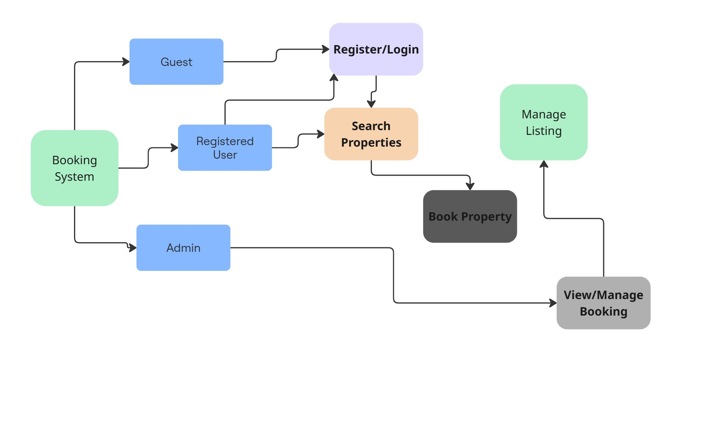

# Requirement Analysis in Software Development

## 📘 Introduction

This repository explores **Requirement Analysis** in the Software Development Lifecycle (SDLC). It outlines the critical role it plays in defining software features and functionalities, ensuring stakeholders have a shared understanding of project scope, expectations, and quality. It also documents examples and diagrams specific to a booking management system.

## 🔍 What is Requirement Analysis?

Requirement Analysis is a fundamental phase in the software development lifecycle where teams gather, analyze, and define the requirements of a software product. It ensures clarity between developers, stakeholders, and end users, laying the groundwork for system design, development, and testing.

### 🔑 Key Benefits of Requirement Analysis:
- **Clarity & Understanding**: Eliminates ambiguity by aligning stakeholder expectations.
- **Scope Definition**: Prevents scope creep through well-defined project boundaries.
- **Design & Development Foundation**: Guides system architecture and implementation.
- **Accurate Estimation**: Helps estimate cost, resources, and delivery timelines.
- **Quality Assurance**: Leads to user satisfaction by meeting agreed-upon requirements.

## ❓ Why is Requirement Analysis Important?

1. **Clarity and Understanding**  
   Provides a mutual understanding of the system’s purpose and user needs.

2. **Scope Definition**  
   Clearly outlines project boundaries, preventing scope creep and delays.

3. **Basis for Design and Development**  
   Offers a structured foundation for system architecture and coding decisions.

## 🔧 Key Activities in Requirement Analysis

- **Requirement Gathering 🗂️**  
  - Interviews  
  - Surveys & Questionnaires  
  - Workshops  
  - Observation  
  - Document Analysis

- **Requirement Elicitation ✍️**  
  - Brainstorming  
  - Focus Groups  
  - Prototyping

- **Requirement Documentation 📚**  
  - Requirement Specification Document  
  - User Stories  
  - Use Case Descriptions

- **Requirement Analysis and Modeling 📊**  
  - Prioritization  
  - Feasibility Analysis  
  - Modeling (DFDs, ERDs)

- **Requirement Validation ✅**  
  - Stakeholder Reviews  
  - Acceptance Criteria Definition  
  - Traceability Matrix

## 📑 Types of Requirements

### ⚙️ Functional Requirements

**Definition**: Describe what the system should do.

**Examples for Booking Management System**:
- Property Search by location, price, and availability
- User Registration and Authentication
- Property Listing with details and images
- Booking System to select dates, confirm booking, and manage reservations

### 🛡️ Non-functional Requirements

**Definition**: Describe how the system should perform.

**Examples**:
- **Performance**: Page loads within 2 seconds; supports 1000 concurrent users
- **Security**: Data encryption and secure login
- **Scalability**: Supports horizontal scaling
- **Usability**: Intuitive and responsive UI/UX
- **Reliability**: 99.9% uptime, with fast recovery from crashes

## 🧭 Use Case Diagrams

**Definition**: A visual representation of user interactions with a system.

**Benefits**:
- Clarifies system functionality
- Enhances communication with stakeholders
- Helps identify required features early

**Actors**:
- Guest  
- Registered User  
- Admin

**Use Cases**:
- Search Properties  
- Register/Login  
- Book Property  
- View/Manage Bookings  
- Manage Listings (Admin)

## ✅ Acceptance Criteria

**Definition**: Conditions a feature must meet to be considered complete.

### Why It's Important:
- Ensures alignment between stakeholders and developers
- Provides a benchmark for testing
- Improves feature quality and consistency

### Example: *Checkout Feature*
- Users can select available dates
- Confirm booking within 2 minutes
- Receive confirmation email upon booking
- Page should load in under 2 seconds
- Booking is saved securely in database
